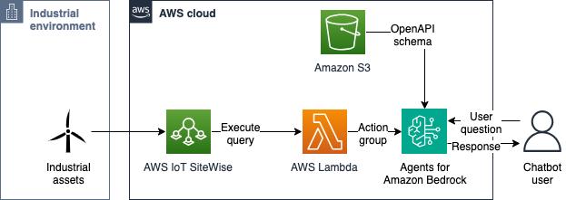
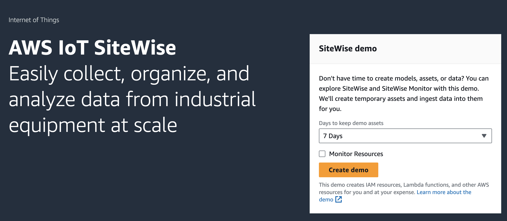
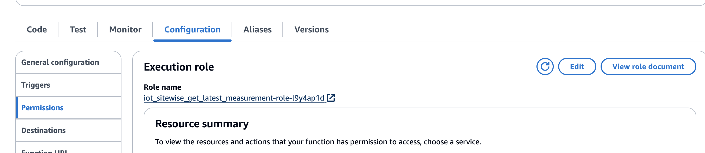
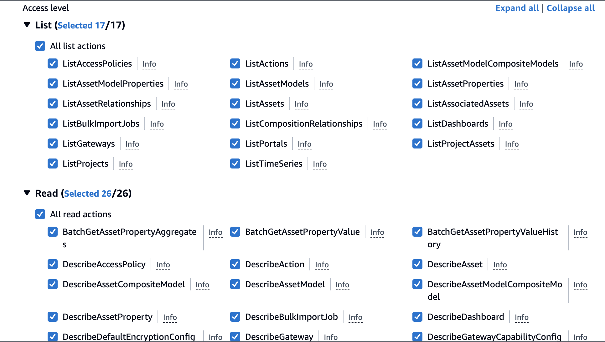
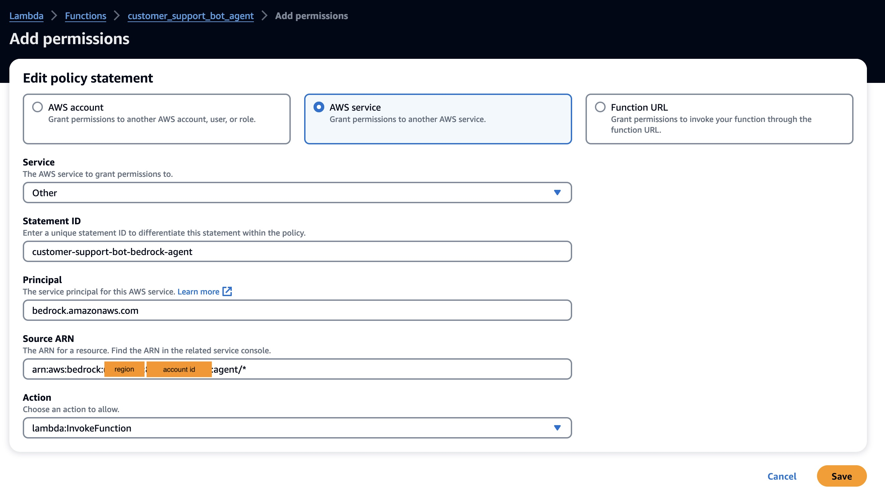
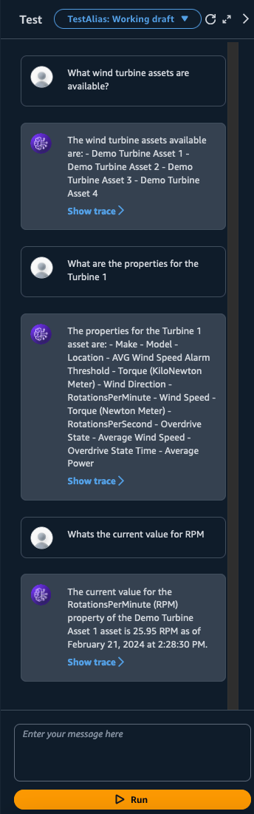

# AWS IoT SiteWise conversational agent

The AWS IoT SiteWise conversational agent is an agent-based implementation of the AWS IoT SiteWise API. This implementation leverages Agents for Amazon Bedrock.

This agent allows chatbots to provide users not only with information extracted from corporate knowledge bases but also with the operational state of their industrial assets without having to go to external industrial automation products (e.g., HMI, historian).

The architecture of the conversational agent is shown below. This repository contains the files required to define:

- An AWS Lambda function with actions designed to consume data from AWS IoT SiteWise
- An OpenAPI API with methods that invoke the Lambda function
- Instructions for the Bedrock agent



## Deployment

> **_PRE-REQUISITES:_** This agent uses the SiteWise SQL engine, which requires that AWS IoT SiteWise and AWS IoT TwinMaker are integrated. Please follow [these steps](https://docs.aws.amazon.com/iot-sitewise/latest/userguide/integrate-tm.html) before deploying the agent.

### Deployment steps

1. _SiteWise assets_: You must have assets in AWS IoT SiteWise that are receiving telemetry data. If you don't have physical or simulated devices, you can launch a SiteWise demo by clicking on `Create demo` in the AWS console. See [Using the AWS IoT SiteWise demo](https://docs.aws.amazon.com/iot-sitewise/latest/userguide/getting-started-demo.html) for additional details

    

1. _OpenAPI specification_: Upload the `openapischema/iot_sitewise_agent_openapi_schema.json` file to S3; note the bucket and path. We are going to need this later.

2. _Lambda function_: Create a Lambda function to define the action group that the agent will use. This function will need a recent version of the boto3 library to be able to call the ExecuteQuery API in SiteWise.

    You have two options to create the Lambda function:

   - **Manually**: Create a Lambda function to define the action group that the Bedrock agent will use. This function will need a version greater or equal than 1.34 for boto3. You can follow [these instructions](https://docs.aws.amazon.com/lambda/latest/dg/creating-deleting-layers.html) to build a Lambda layer with a more modern version of boto3 to allow the agent to work. **Continue to step 4.**

   - **Using Serverless Application Model (SAM)**: SAM will automatically deploy the Lambda function and its dependencies as a container. This repository includes the definition of the Lambda function and the role in the `template.yaml` file. To build and deploy, run the following commands on your terminal. See [Using the AWS SAM CLI](https://docs.aws.amazon.com/serverless-application-model/latest/developerguide/using-sam-cli.html) for detailed information on using the `AWS SAM CLI`.

       ```bash
       sam build --use-container
       sam deploy --guided
       ```

    **Continue to step 5.**

3. _Permissions_: Edit the Lambda configuration to change `Permissions` and give it access to query from IoT SiteWise. Click on the Execution Role to edit permissions for that role using AWS IAM.

    

    In IAM, click on `Add permission` and `Create inline policy`. Under service, select IoT SiteWise. Click under `All list actions` and `All read actions`.

    

    Select `All` under resources.

    Go back to the AWS Lambda console. You will now need to add a resource-based policy for Bedrock to invoke the action. In the Lambda function go to `Configuration/Permissions` and scroll down to `Resource-based policy statements` and click on `Add permissions`.

    

    Set principal to bedrock.amazonaws.com and source ARN to `arn:aws:bedrock:<REGION>:<ACCOUNT_NUMBER>:agent/*` and click on `Save` to continue. See [Resource\-based policy to allow Amazon Bedrock to invoke an action group Lambda function](https://docs.aws.amazon.com/bedrock/latest/userguide/agents-permissions.html#agents-permissions-lambda) for details and best practices.

4. _Conversational agent_: To build the agent, go to the Amazon Bedrock console and click on `Agents` under `Orchestration`. Click on `Create Agent`.

    Give your agent a meaningful name (e.g., `industrial-watchdog-agent`). Select a model and its version, e.g., `Anthropic - Claude V2`. For agent instructions, you can paste:

    > You are an agent that helps operators get the most recent measurement available from their wind turbines. You are going to give responses in human-readable form, which means spelling out dates. If no clear instruction is provided, ask for the name of the asset and the name of the property whose measurement we want to retrieve.

    Under `Action Groups`, select the Lambda function you created in step 3, and browse or enter the S3 URL that points to the API schema from step 2.

    Go to `Review and create`.

5. _Testing_: Ask questions about the current status of your assets. If you used the SiteWise demo to deploy assets, you can ask:

- What assets are available?
- What is the RPM in turbine 1?

    > Note that even if you ask for an asset or a property not using the exact property or asset name stored in SiteWise, it can still reason and retrieve the value.

    

## Security

See [CONTRIBUTING](CONTRIBUTING.md#security-issue-notifications) for more information.

## License

This library is licensed under the MIT-0 License. See the LICENSE file.
